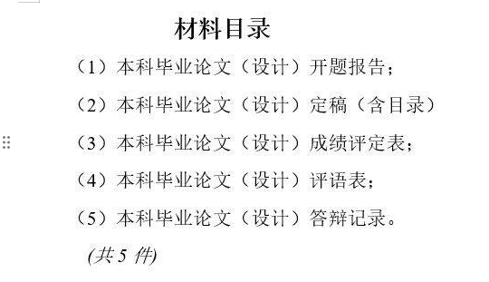
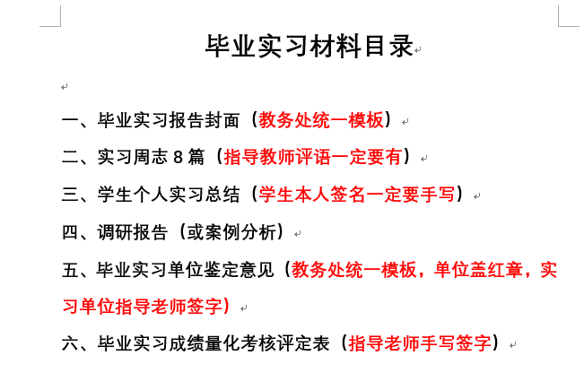

## 1. 本科毕业论文说明

### 1.1 一般性原则

毕业实习论文是学生自己的论文，指导老师只提供指导。学生应发挥主观能动性，及时、主动向老师汇报进展，并与老师讨论以改善论文。

如有问题可以：1. 少量简单问题：邮件讨论；2. 问题较多或较难：发邮件约时间讨论。My Email: 121657961@163.com。请勿在微信上问问题。

### 1.2 毕业论文格式

本科毕业论文格式依照子文件夹“本科毕业论文格式”的文档。

### 1.3 毕业论文流程

确保毕业论文题目与“选题名称”一致。论文题目需要微调的，自行在系统上调整并通知老师审核。

在系统中上传的文档包括外文翻译，指翻译一篇与本文相关的英文文献全文（不少于10页）。

答辩前一周老师不再提供服务。请合理安排时间，确保答辩前一周所有问题都已解决。最迟在答辩截止日期前两天在系统上传论文，方便老师评阅。未及时上传论文或者上传论文达不到要求的则参加下一轮答辩。

论文答辩后，根据答辩组老师的意见修改论文，在“特殊情况处理”里重新上传。

### 1.4 最终上交材料

注：论文答辩记录不需要学生提供。

## 2. 毕业实习说明

最终上交材料：

